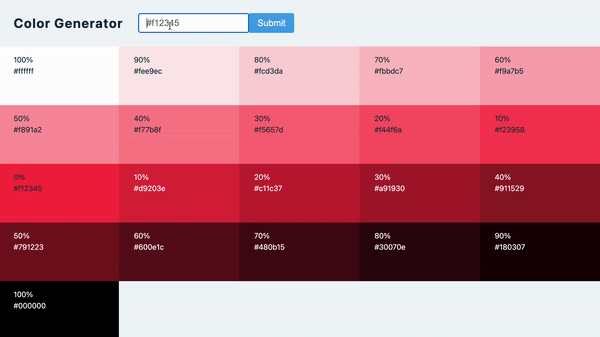

## Summary

Enter hex color to generate tints and shades.

Library: [values.js](https://github.com/noeldelgado/values.js)

[Live Demo](https://christy313.github.io/react15-project09)



## File structure

```
.
├── README.md
└── src
    ├── App.js
    ├── SingleColor.js
    ├── index.css
    └── index.js
```

## Notes

[Clipboard.writeText()](https://developer.mozilla.org/en-US/docs/Web/API/Clipboard/writeText)

## Available Scripts

In the project directory, you can run:

### `npm start`

Runs the app in the development mode.\
Open [http://localhost:3000](http://localhost:3000) to view it in your browser.